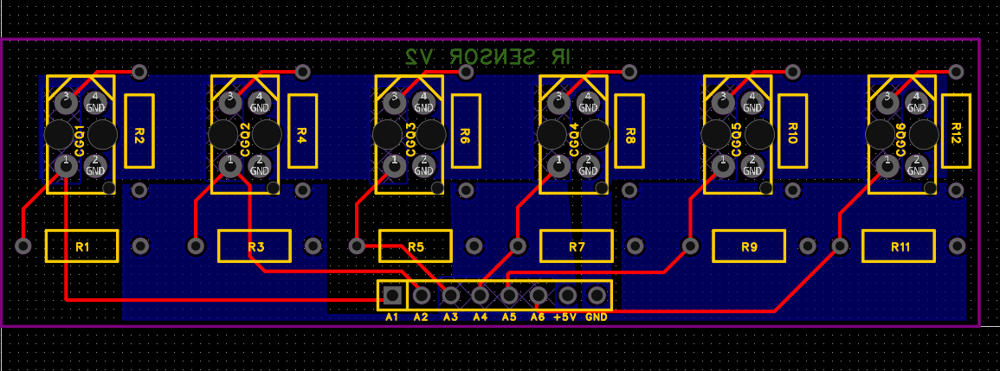
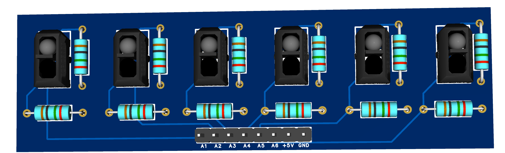
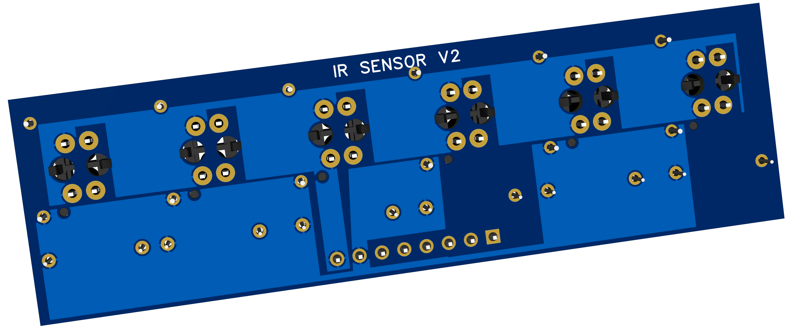

# IR Sensor Array PCB Design for Line Follower Robot

This repository contains the PCB design files for an **IR sensor array** used in a line follower robot.  

---

## 📐 PCB Layout

---

## 🖥️ 3D View
  

---

## 📂 Folder Contents
- `schematic.png` – Circuit schematic  
- `pcb-layout.pdf` – PCB layout in PDF format  

