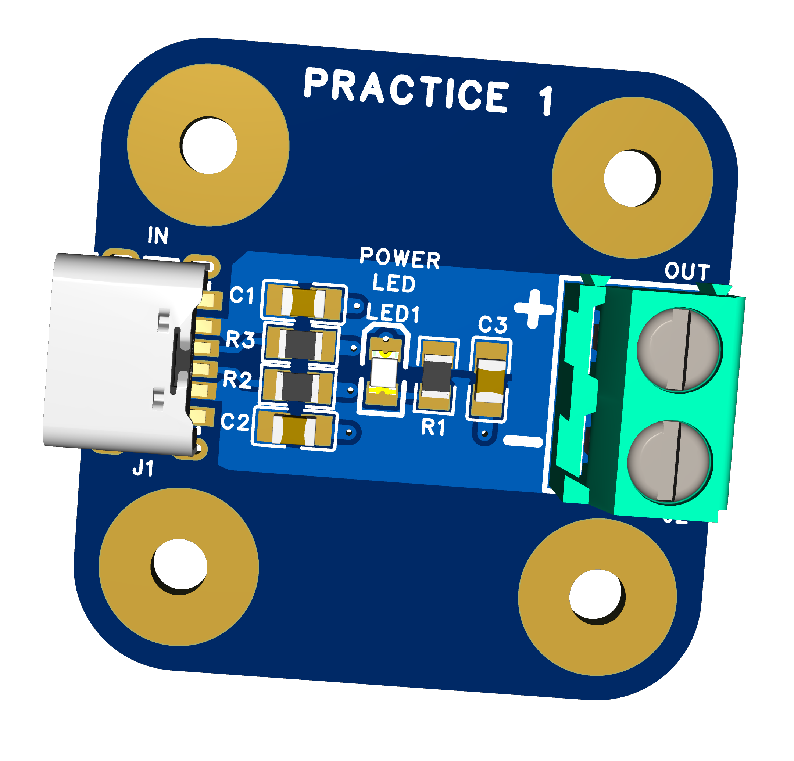
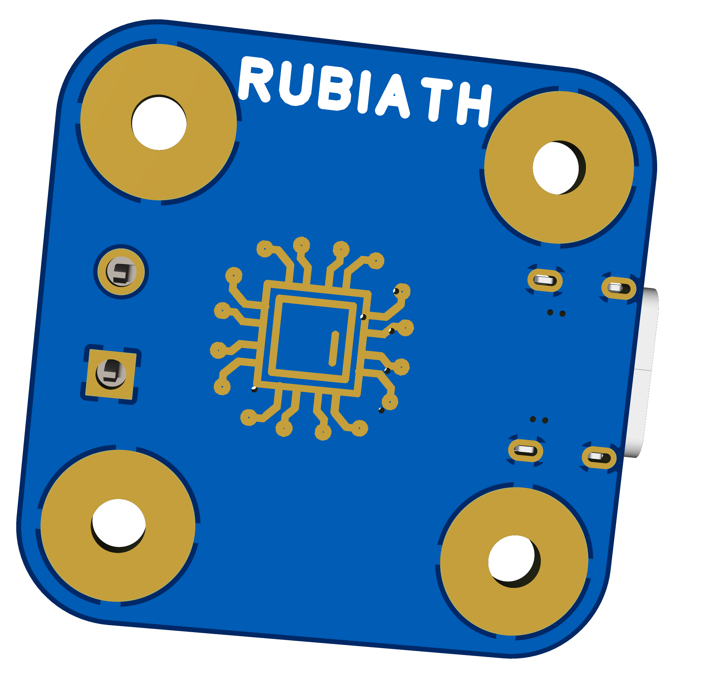

This is a USB C Power Supply PCB made in **EasyEDA Online**, following a tutorial.  
What I practiced:
- Drawing a schematic
- Converting to PCB layout
- Exporting files (PDF, Gerber)

## 🖥️ 3D View
  
  

**Files in this folder:**
- `schematic.pdf` — Circuit schematic
- `pcb-layout.pdf` — PCB layout pdf
- `pcb-layout.png` — PCB layout image
- `project-files/` — EasyEDA source (JSON/ZIP), Gerbers, etc.

> Status: Beginner level project for learning workflow.
